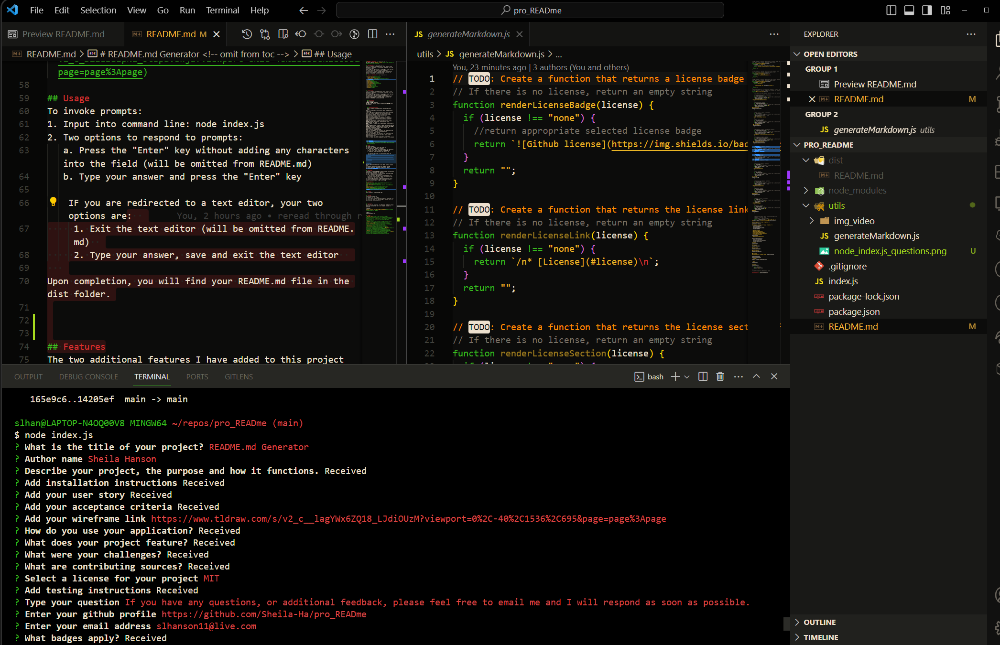

# README.md Generator <!-- omit from toc -->
by Sheila Hanson 

## Description <!-- omit from toc -->
This is a command-line application using inquirer that dynamically generates a professional README.md file from the user's input.  
When using this application it is going to allow the user to devote more time to working on the project.  
The function is invoked through command "node index.js" and the user responds to prompts. Upon finishing the prompts a README.md file is generated.

## Table of Contents <!-- omit from toc -->
  
- [Installation](#installation)
  - [User Story](#user-story)
  - [Acceptance Criteria](#acceptance-criteria)
  - [Wireframe](#wireframe)
- [Usage](#usage)
- [Features](#features)
- [Challenges](#challenges)
- [Contributing](#contributing)
- [License](#license)
- [Testing](#testing)
- [Questions](#questions)
- [Badges](#badges)
    

## Installation
This is a command-line application using inquirer that dynamically generates a professional README.md file from the user's input.  
When using this application it is going to allow the user to devote more time to working on the project.  
The function is invoked through command "node index.js" and the user responds to prompts. Upon finishing the prompts a README.md file is generated.
    
  
  ### User Story
  AS A developer  
I WANT a README generator  
SO THAT I can quickly create a professional README for a new project
    
  
  ### Acceptance Criteria
  GIVEN a command-line application that accepts user input  
WHEN I am prompted for information about my application repository  
THEN a high-quality, professional README.md is generated with the title of my project and sections entitled Description, Table of Contents, Installation, Usage, License, Contributing, Tests, and Questions  
WHEN I enter my project title  
THEN this is displayed as the title of the README  
WHEN I enter a description, installation instructions, usage information, contribution guidelines, and test instructions  
THEN this information is added to the sections of the README entitled Description, Installation, Usage, Contributing, and Tests  
WHEN I choose a license for my application from a list of options  
THEN a badge for that license is added near the top of the README and a notice is added to the section of the README entitled License that explains which license the application is covered under  
WHEN I enter my GitHub username  
THEN this is added to the section of the README entitled Questions, with a link to my GitHub profile  
WHEN I enter my email address  
THEN this is added to the section of the README entitled Questions, with instructions on how to reach me with additional questions  
WHEN I click on the links in the Table of Contents  
THEN I am taken to the corresponding section of the README

    
  
  ### Wireframe
  [My Wireframe](https://www.tldraw.com/s/v2_c_DZiLS8zpN1_JtBpaVskja?viewport=0%2C-40%2C1536%2C695&page=page%3Apage)
      
## Usage 
To invoke prompts:  
1. Input into command line: node index.js  
2. Two options to respond to prompts:  
   a. Press the "Enter" key without adding any characters into the field (will be omitted from README.md)  
   b. Type your answer and press the "Enter" key
   
    IF you are redirected to a text editor, your two options are:  
     1. Exit the text editor (will be omitted from README.md)  
     2. Type your answer, save and exit the text editor  
        a. the terminal will display "Received"
   
Upon completion, you will find your README.md file in the dist folder.

## Features
The two additional features I have added to this project are:  
1. Omitting sections you might not need to include  
2. Having multiline responses using a text editor  
3. Including a wireframe

## Challenges
I wanted to create a README.md that included more sections and functions than what was required:
1. How to omit sections if I do not want to include them  
2. How to have multiline responses  
   a. How to create appropriate structure breaks with multiline responses (add 2 spaces to the end of your input before you go to next line)
3. Discovering tab/spaces in generateMarkdown.js matter  
4. Wanted to add icons so added the package Fantastic Icons, but was not able to get it working

## Contributing
[npm](https://www.npmjs.com/package/inquirer/v/8.2.4?activeTab=readme#installation)  
[mdn web docs](https://developer.mozilla.org/en-US/docs/Web)  
[node.js](https://nodejs.org/docs/latest/api/)  
[stack overflow](https://stackoverflow.com/newreg=67d94556b887449fa2885dadf54a5439)  
[tldraw](https://www.tldraw.com/)

## License 
This project is licensed under MIT

## Testing
Testing your README.md  
1. complete all the prompts  
2. verify your responses we generated into README.md file  
3. verify all links are redirecting to outside source or directing you within README.md

    

## Questions
If you have any questions, or additional feedback, please feel free to email me and I will respond as soon as possible.
    
* Github -
[https://github.com/Sheila-Ha/pro_READme](https://github.com/Sheila-Ha/pro_READme)

* Email -
slhanson11@live.com

## Badges
  
  
  
  
